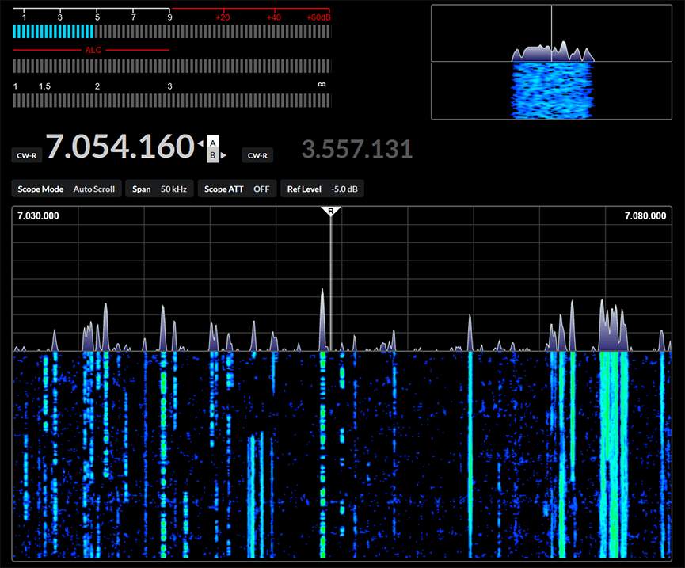

# open890

open890 is a web-based UI for the Kenwood TS-890S amateur radio, and features good usability, 
clean design, and high-speed bandscope/audio scope displays, among other features not available
either on the radio itself, or in the ARCP remote control software.

It is currently only designed to interface with the TS-890 via a LAN (or wifi) connection, and not
a USB/serial connection. It may work with the TS-990, as the command set is very similar, but is
currently untested.

## Installation from source

See [Installing From Source](https://github.com/tonyc/open890/wiki/Installing-From-Source)

## Docker

If you are knowledgeable in Docker, you can either pull a published image from the repository,
or build & run your own image locally.

At the moment, open890:latest reflects what is pushed to the `main` branch. Eventually,
releases will be tagged as well.

### Pull & run a published image

    docker pull ghcr.io/tonyc/open890:latest
    docker run -p 4000:4000 -it --rm ghcr.io/tonyc/open890:latest

### Build your own Docker image locally

Build the image, and start a container using the image, exposing the internal server to your host:

    make docker

You should now be able to access http://localhost:4000

If you would like to just build the image, you can run `make build_docker`.

## Binary releases

Platform/architecture-specific binary releases are available from [releases](https://github.com/tonyc/open890/releases/latest).

### Raspberry Pi

Binary builds are not available for Raspberry Pi due to CPU architecture differences. You will need to install from source (see above)
in order to get open890 running on a RPi.

### Linux (Ubuntu)

Linux binaries are supported to run on 64-bit Ubuntu 20.04, although other modern Linux releases may work (or not).

Download the release `.tar.gz`

Then, decide where you want open890 to live, usually somewhere in your home directory.

    cd <where you want it>
    tar zxvf /path/to/open890-release.tar.gz

You will then get a subdirectory called `open890`.

    cd open890
    ./open890.sh

And then open a web browser to http://localhost:4000

If you encounter an error related to shared libraries, etc, they _may_ be solved by installing the correct version,
although the correct packages may not be available in your OS distribution's package manager. 

If all else fails, install from source.

### Windows

  * Download the Windows release .zip file, and extract it somewhere useful.
  * Navigate to where you expanded open890
  * Double click the `open890.bat` file in the main folder.

You will probably see several security warnings as described below. After getting through those, access the web interface at http://localhost:4000 with your favorite web browser.

#### "Windows Protected your PC"

Since I haven't paid for a certificate to sign binaries, Windows will loudly complain about an unknown developer.

 * Click "More Info" and choose "Run anyway". 

If you are concerned about the safety of the files, **only ever download direct from the Github releases page**, and additionally, compare the MD5 checksum from the release notes with the file you have. An internet search for "Windows MD5 tool" will yield several results if you are concerned.

#### Windows Security Alert

On first run, you will likely receive a warning from Windows stating, "Windows Defender Firewall has blocked some features of this app" - For one or more of the following files:

 * erl.exe

This is due to open890's client-server architecture, and it needs permission to open a port (4000) for the local webserver. Only choose the "private network" option for open890.

## Network Safety/Security

open890 runs a web server on port `4000` and binds to `0.0.0.0` (all interfaces) on the machine it runs on. If this is not acceptable, please do not run open890.

Please note that the web interface **is not secured with a password**, and it assumes that you will run it on a trusted network. This is equivalent to running a computer with ARCP-890 left running. Again, if you are not OK with this, please do not run open890.

Future releases may incorporate a basic level of authentication to access the web interface, or allow the IP address/port binding to be changed.

## Getting Help

If you encounter a bug, please [open a discussion](https://groups.io/g/open890). Please do not directly email me for technical support!

## Contributing

* [Start a discussion](https://groups.io/g/open890) so we can discuss your idea
* Fork this repository
* Make your changes in a branch in your own repo
* Open a pull request!

## Legal mumbo-jumbo

This project is licensed under the MIT license. Please see [MIT-LICENSE](MIT-LICENSE) for more details.

All product names, logos, brands, trademarks and registered trademarks are property of their respective owners. All company, product and service names used in this software are for identification purposes only.

